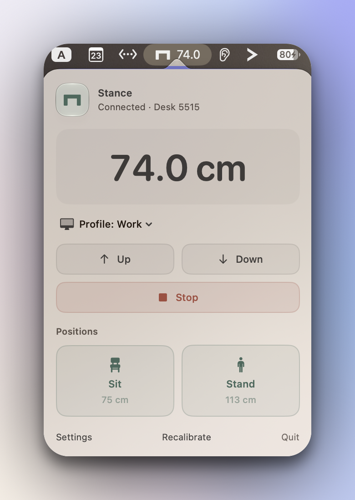
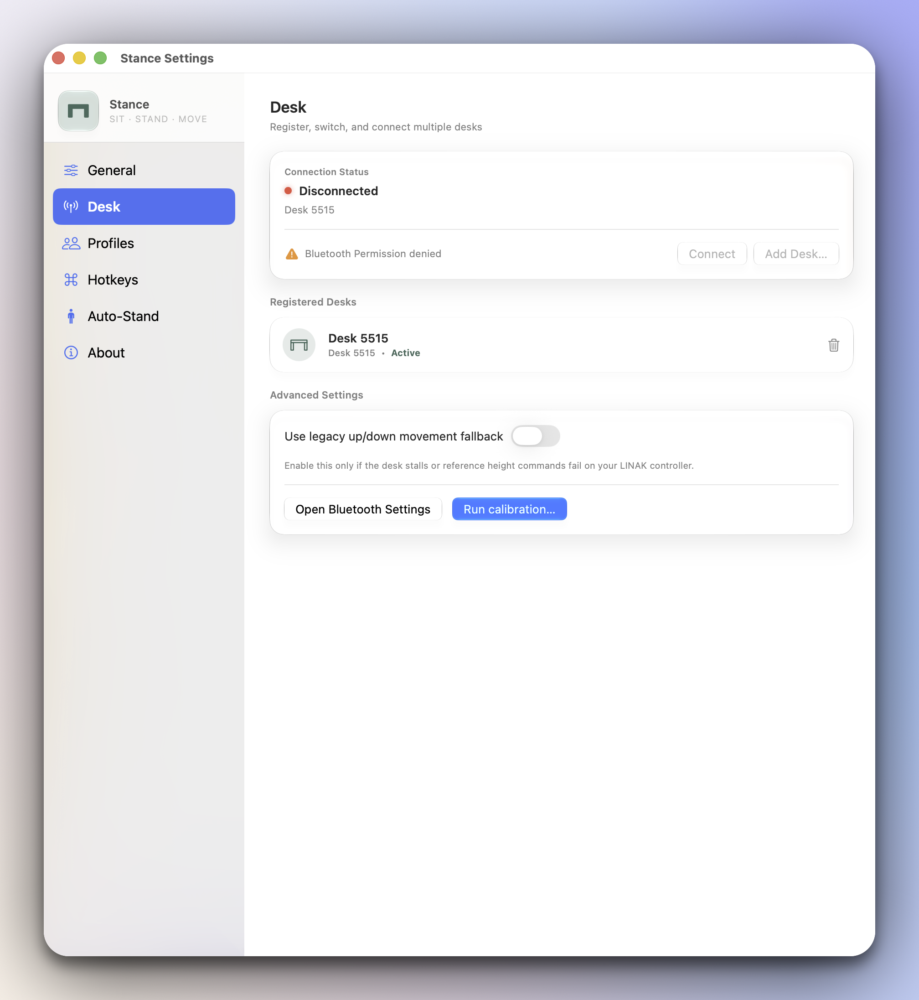
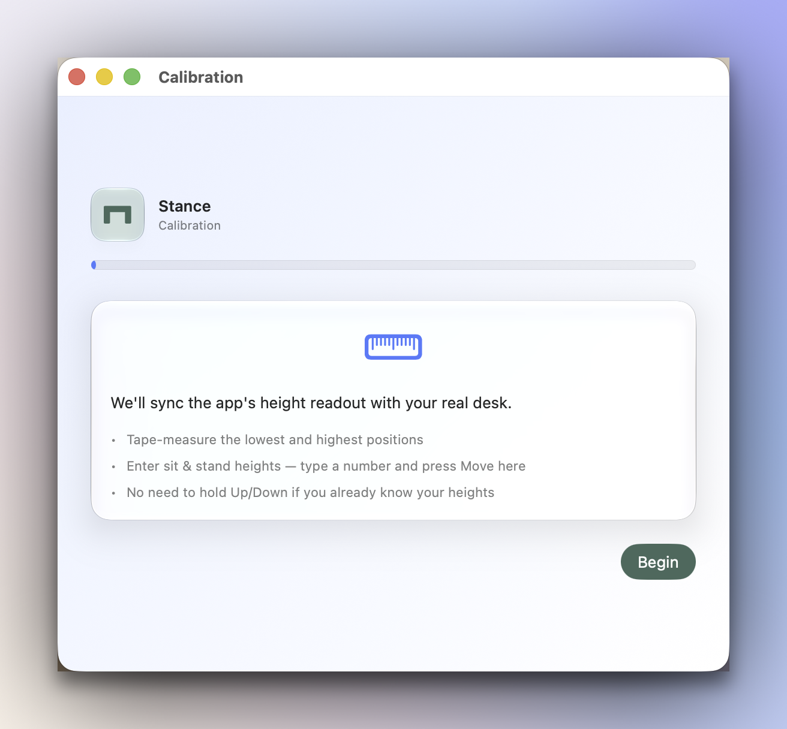
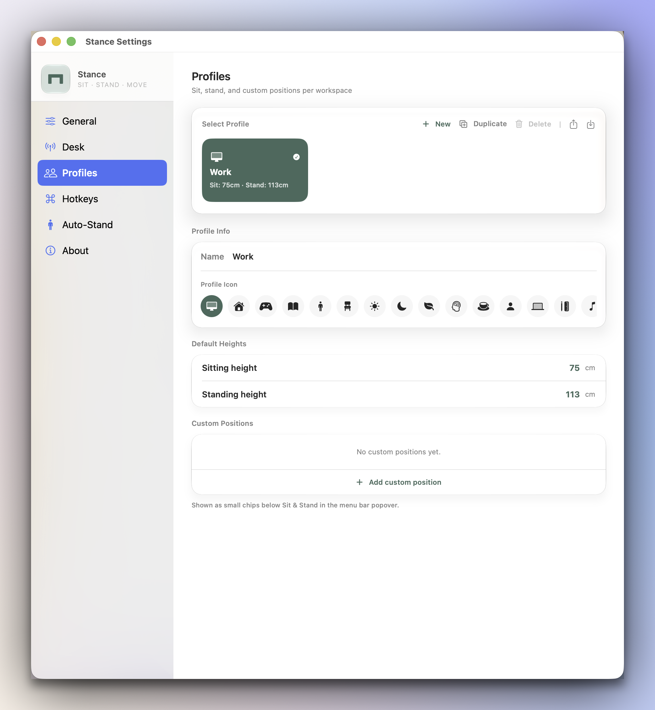
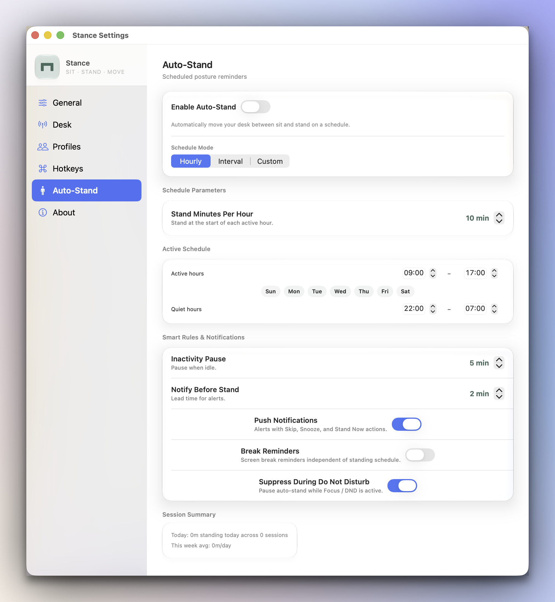
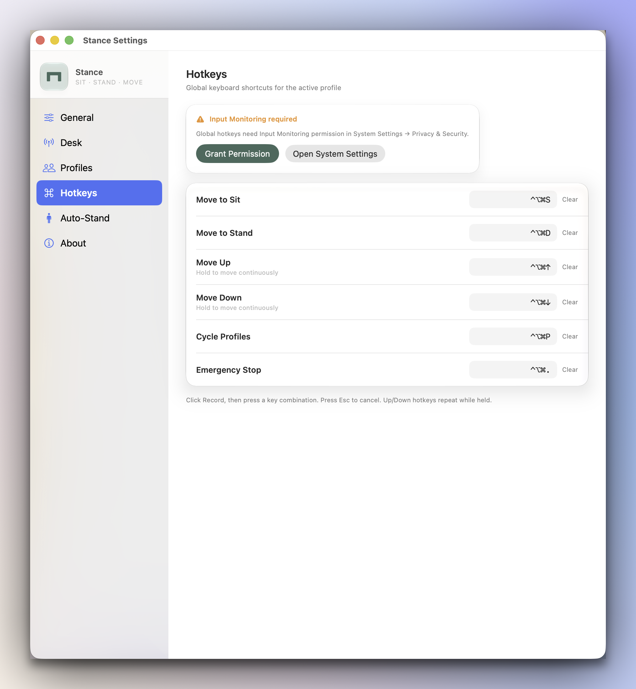

# Stance

**Sit · Stand · Move** — a native macOS menu bar app to control IKEA IDÅSEN and LINAK sit-stand desks over Bluetooth.

> Unofficial project. Not affiliated with or endorsed by IKEA or LINAK. IKEA® and IDÅSEN® are trademarks of Inter IKEA Systems B.V.

<p align="center">
  
</p>

<p align="center">
  
</p>

## What it does

Stance lives in your menu bar and connects to your desk over **Bluetooth** — no cloud, no account, no phone app required while using your Mac. Connect once, calibrate, then move between sit, stand, and custom heights from the popover, keyboard shortcuts, or Siri/Shortcuts.

## Screenshots

| Menu bar popover | Settings — Desk | Calibration |
|------------------|-----------------|-------------|
|  |  |  |

| Profiles | Auto-Stand | Hotkeys |
|----------|------------|---------|
|  |  |  |


## Features

### Menu bar & desk control

- **Menu bar popover** — live height readout, range percentage (when calibrated), connection status
- **Move controls** — hold Up/Down to nudge, Stop, Sit and Stand preset tiles with heights
- **Custom positions** — named chips (e.g. Lunch, Focus) per profile
- **Optional height in menu bar** — show current height next to the icon (Settings → General)
- **Right-click menu** — quick Sit/Stand/Up/Down/Stop, Settings, Calibration, Quit without opening the popover
- **Multi-desk** — register several LINAK desks, switch active desk from the popover or Settings
- **Desk picker** — choose a desk when multiple are in range

### Bluetooth & connection

- **Auto-connect** — remembers your desk, reconnects on wake from sleep
- **Exponential backoff** — retries on disconnect (1s → 2s → … up to 30s)
- **Manual scan** — Add Desk flow for pairing new desks
- **GATT validation** — “Connected” only after services are ready
- **Legacy movement fallback** — toggle for desks that need impulse up/down instead of reference-input moves
- **Helpful errors** — hints when another app (IKEA Home smart, LINAK) holds the BLE connection

### Calibration

- **Guided wizard** — measure min/max travel, set comfortable sit and stand heights
- **Per-desk offset** — replaces hardcoded LINAK offset with your desk’s measured values
- **Recalibrate anytime** — from the popover footer or Settings → Desk

### Profiles

- **Multiple profiles per desk** — Work, Home, etc. with own sit/stand heights and hotkeys
- **Custom positions** — unlimited named presets with icons
- **Quick switcher** — in the menu bar popover; cycle with hotkey (scoped to active desk’s profiles)
- **Import / export** — JSON backup and sharing of profile sets

### Global hotkeys

Per-profile, fully remappable (defaults use ⌃⌥⌘):

| Action | Default |
|--------|---------|
| Move to Sit | ⌃⌥⌘S |
| Move to Stand | ⌃⌥⌘D |
| Move Up (hold to repeat) | ⌃⌥⌘↑ |
| Move Down (hold to repeat) | ⌃⌥⌘↓ |
| Cycle profiles | ⌃⌥⌘P |
| Emergency stop | ⌃⌥⌘. |

- **Conflict detection** when recording a combo already used by another action
- **Input Monitoring** permission (System Settings → Privacy & Security)

### Auto-Stand

Encourages posture changes on a schedule (per profile):

| Mode | Behavior |
|------|----------|
| **Hourly** | Stand for N minutes at the start of each hour, sit for the rest |
| **Interval** | Sit for X minutes, then stand for Y, repeat |
| **Custom** | Your own time blocks (stand / sit / height / preset) |

**Smart rules:** active hours & weekdays, quiet hours, inactivity pause, Focus/DND suppression, optional break reminders, pre-stand notifications.

**Notifications** (optional): alerts with **Stand Now**, **Snooze 5 min**, and **Skip** actions.

**Session tracking:** today’s standing time and weekly average in Settings → Auto-Stand.

### Shortcuts, Siri & Spotlight

**App Intents** (Shortcuts app + Siri):

- Move desk to Sit / Stand
- Move to exact height (cm or inches)
- Nudge up / down
- Get current height
- Switch profile
- Get active profile (with sit/stand heights)
- Standing session summary for today

**Spotlight** indexes your active desk (name, height, status) and profiles for quick search.

### General settings

- Metric or imperial display
- Launch at login (works when Stance is installed in Applications with signing — see **Getting Stance on your Mac**)
- About screen with version and GitHub link

### Design

- Clean native Mac interface (menu bar app)
- Frosted-glass look on newer macOS versions
- Haptic feedback when preset moves finish
- **App icon** — sage green square with a simple desk/table symbol (same as the menu bar icon)

## Requirements

- **Mac** running **macOS 15** (Sequoia) or later
- **IKEA IDÅSEN** or compatible **LINAK** sit-stand desk with Bluetooth
- **Bluetooth** turned on
- **Xcode** — only if you [build from source](#option-b--build-from-source-advanced); not needed for the download

## Getting Stance on your Mac

Stance is not in the App Store yet. The easiest way to get it is to **download a ready-made release** — no Xcode, no Terminal, no compiling.

### Which install path is for you?

| | **Option A — Download** | **Option B — Build from source** | **Option C — Dev quick try** |
|---|-------------------------|----------------------------------|------------------------------|
| **Who** | **Most people** | Power users who want Apple ID signing | People editing the code |
| **Needs Xcode?** | No | Yes | Yes |
| **Time** | ~2 minutes | ~15 minutes first time | Ongoing while coding |
| **Bluetooth permission** | Asked once per install (may ask again after updating) | Best — remembered if signed with Apple ID | May ask **every launch** |

---

### Option A — Download a release (recommended)

1. Open **[GitHub Releases](https://github.com/alexandrustefan/stance-ikea-desk-controller/releases)** and download the latest **`Stance-x.x.x.dmg`**.
2. Double-click the DMG to open it.
3. **Drag Stance into Applications** (use the shortcut in the DMG window, or drag to Applications in Finder).
4. **First launch only — macOS will block the app** because it is not signed with an Apple Developer certificate. This is normal for free open-source Mac apps. Do **one** of the following:
   - **Right-click** (or Control-click) **Stance** in Applications → **Open** → confirm **Open** in the dialog, **or**
   - Try to open Stance, then go to **System Settings → Privacy & Security** and click **Open Anyway**.
5. After that, you can open Stance normally from Applications or Spotlight (⌘Space → “Stance”).
6. Click **Allow** when macOS asks for **Bluetooth**.

Stance appears as a **table icon in the menu bar** (top-right). There is no Dock icon unless the popover is open.

**Updating:** Download the new DMG, replace Stance in Applications, and use **Right-click → Open** once again if macOS blocks the updated version.

**Launch at login** (Settings → General) may not work with downloaded releases until Apple Developer signing is added — build from source with your Apple ID (Option B) if you need that.

---

### Option B — Build from source (advanced)

Do this if you want **Launch at login**, the most reliable **Bluetooth permission** behavior, or the very latest code before a release is published.

#### Step 1 — Download the project

Open **Terminal** (Spotlight → type “Terminal”) and paste these lines one at a time:

```bash
brew install xcodegen
git clone https://github.com/alexandrustefan/stance-ikea-desk-controller.git
cd stance-ikea-desk-controller
xcodegen generate
open IKEADeskController.xcodeproj
```

That last line opens the project in **Xcode**. If `brew` is not found, install [Homebrew](https://brew.sh) first, or skip the first line and run `xcodegen generate` after installing xcodegen another way.

#### Step 2 — Sign in with your Apple ID (one-time)

In Xcode:

1. Click the blue **IKEADeskController** project icon in the left sidebar.
2. Select the **IKEADeskController** target under **TARGETS**.
3. Open the **Signing & Capabilities** tab.
4. Check **Automatically manage signing**.
5. Choose your **Team** — pick your personal Apple ID. (A free Apple ID is enough; you do not need a paid developer account.)

Xcode may ask you to sign in once. This tells macOS “this app is really from me,” which is what makes Bluetooth permission stick.

#### Step 3 — Build and move Stance to Applications

Pick **one** of these — both do the same thing:

**3a — All in Xcode (easiest if you dislike Terminal)**

1. At the top of Xcode, set the scheme to **IKEADeskController** and the run destination to **My Mac**.
2. Menu bar → **Product → Build** (or press ⌘B).
3. When the build finishes, menu bar → **Product → Show Build Folder in Finder**.
4. Open **Products** → you should see **Stance.app**.
5. **Drag Stance.app into your Applications folder** (Finder sidebar → Applications).

**3b — Install script (one Terminal command)**

If you already did Steps 1–2, you can use a small helper script instead of dragging files yourself. It builds Stance and copies it into Applications for you.

In Terminal, from the project folder:

```bash
cd stance-ikea-desk-controller   # skip if you're already there
./Scripts/install.sh
```

That’s it — no need to know what the script does internally. It is just “build Release version → copy to `/Applications/Stance.app`.”

If the script cannot find your signing team, set it in Xcode (Step 2) and run the script again. Advanced users can also run `DEVELOPMENT_TEAM=YOUR_TEAM_ID ./Scripts/install.sh` — your Team ID is shown in Xcode under Signing.

#### Step 4 — Open Stance

- Open **Applications** (or press ⌘Space and type **Stance**).
- Click **Allow** when macOS asks for **Bluetooth** — you should only see this once.
- Stance appears as a **table icon in the menu bar** (top-right). There is no Dock icon unless the popover is open.

To remove an old copy you were testing from Xcode: quit Stance, then delete any extra **Stance.app** sitting in a `build` folder so you always launch the one in Applications.

---

### Option C — Quick try without installing (for development)

Use this only while **changing the code** or running tests. The app stays in a hidden build folder, is not properly “installed,” and macOS often treats each build as a new app — so **Bluetooth may ask every launch**. That is annoying but normal for this mode.

```bash
xcodegen generate
xcodebuild build -project IKEADeskController.xcodeproj -scheme IKEADeskController \
  -configuration Debug \
  -derivedDataPath build/DerivedData \
  CODE_SIGN_IDENTITY="-" CODE_SIGNING_REQUIRED=NO
open build/DerivedData/Build/Products/Debug/Stance.app
```

Or press **Run** (▶) in Xcode with default settings. Same Bluetooth behavior applies.

---

### Why does Bluetooth keep asking?

macOS ties privacy permissions (Bluetooth, etc.) to **where the app lives** and **how it was signed**.

- **Downloaded or installed in Applications** → usually asked once per version you install.
- **Signed with your Apple ID + in Applications** (Option B) → best experience; permission remembered reliably.
- **Run straight from Xcode or a `build/…` folder** (Option C) → macOS sees a “new” app after each build → asks again.

If you hit this while developing, use **Option A** or **Option B** for daily use instead.

### Permissions Stance may ask for

| Permission | When you'll see it | What it's for |
|------------|-------------------|---------------|
| **Bluetooth** | First launch (once if installed properly) | Find and control your desk |
| **Input Monitoring** | When you turn on keyboard shortcuts | Global hotkeys while other apps are open |
| **Notifications** | When Auto-Stand reminders are enabled | “Time to stand” alerts with actions |

You can change these anytime in **System Settings → Privacy & Security**.

## Quick start

1. Click the **Stance** icon in the menu bar (table symbol).
2. **Settings → Desk** — connect your desk. If it fails, quit the IKEA/LINAK phone app and try again.
3. **Calibration** — run the wizard to set range and sit/stand heights.
4. Move from the **popover**, **hotkeys**, or **Siri** (“Stand up with Stance”).

## Development

For contributors and advanced setup (running tests, regenerating the app icon, unsigned CI builds), see [CONTRIBUTING.md](CONTRIBUTING.md).

```bash
xcodegen generate
xcodebuild test \
  -project IKEADeskController.xcodeproj \
  -scheme IKEADeskController \
  -destination 'platform=macOS' \
  CODE_SIGN_IDENTITY="-" \
  CODE_SIGNING_REQUIRED=NO
```

**Test suite** (60+ unit tests): desk protocol, calibration math, profiles & persistence, auto-stand scheduling, hotkey conflicts, unit conversion, and more. BLE and UI are not automated — use a real desk for integration testing.

## License

[MIT](LICENSE) — Copyright (c) 2026 Alexandru Stefan
